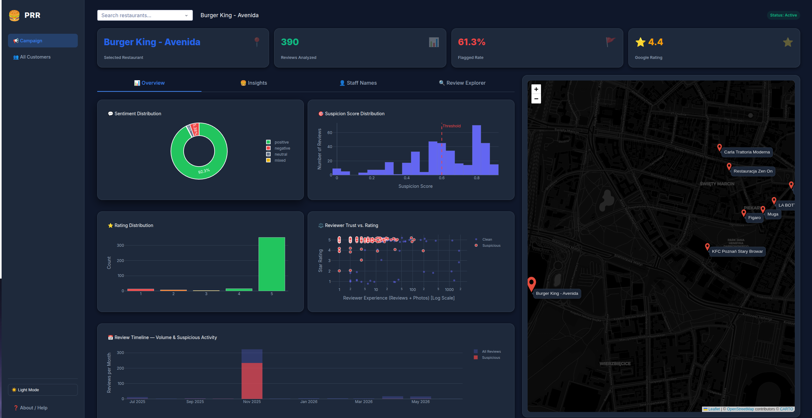

# Google Maps Review Scraper & Analyzer



A high-performance, stealthy pipeline for extracting, analyzing, and visualizing Google Maps restaurant reviews. This toolkit helps you discover patterns, extract rich metadata (like reviewer history), run NLP analysis via Large Language Models (LLMs), and detect suspicious "fake review" bursts using a beautiful, interactive dashboard.

## ✨ Features

- **Stealth Data Extraction:** A Playwright and Camoufox-powered scraper that injects JS directly into the browser to extract reviews at high speeds without triggering bot detection.
- **LLM-Powered NLP Analysis:** Utilizes Google Gemini or local Ollama models to perform Aspect-Based Sentiment Analysis, identify mentioned staff members, extract dishes, and detect suspicious fake review signals.
- **Dynamic Dark/Light Mode Dashboard:** A stunning, responsive interface built with Plotly Dash featuring a premium UI, interactive dark mode toggle, and responsive Leaflet map integration.
- **Global & Local Analytics:** Compare aggregate statistics across all scraped restaurants, or drill down into specific locations to analyze review depth, reviewer trust, and topic-based sentiment.
- **Review Explorer:** Search, filter, and inspect individual reviews, with automatic highlighting of suspicious entries and integrated anomaly detection.

## 🚀 How the Scraping Algorithm Works

The core of the scraper (`scrape_camoufox.py`) relies on **Camoufox** (a stealth browser based on Firefox) driven by **Playwright**.

Instead of interacting with volatile HTML DOM structures, the scraper injects custom JavaScript (`page.evaluate`) directly into the browser context. This does three things:
1. **Performance:** Eliminates the IPC (Inter-Process Communication) bottleneck between Python and the browser, allowing high-speed scrolling and data extraction.
2. **Stealth & Resiliency:** Minimizes bot-detection risks and easily bypasses Google's frequent layout changes.
3. **Rich Data Extraction:** Automatically parses deep metadata, including reviewer histories (`author_reviews_count`, `author_photos_count`), restaurant types, exact timestamps, and full review text.

It saves each restaurant's data into intelligent, conflict-free `.json` files in the `reviews/` folder.

---

## 🛠️ How to Use the System

### 1. Installation
Clone the repository and install the dependencies:
```bash
pip install -r requirements.txt
```

### 2. Scraping the Reviews
1. Create a `restaurants.txt` (or any `.txt` file) and paste Google Maps URLs or Place IDs, one per line.
2. Run the scraper:
   ```bash
   python scrape_camoufox.py --file restaurants.txt --limit 1000 --max-months 12
   ```
   *This extracts reviews up to 12 months old and saves them into the `reviews/` directory.*

### 3. Preparing the Database
Once you have your JSON files, import them into the SQLite database so the dashboard and analysis tools can read them:
```bash
python import_reviews.py --clean
```
*(The `--clean` flag wipes the old database to prevent duplication of previous runs).*

### 4. AI Analysis & Burst Detection
To enrich your data with LLM analysis (extracting sentiment, staff names, dishes, and fake review signals):
```bash
python analyze.py --all
```
*(Note: Ensure you have `GEMINI_API_KEY` set in your `.env` file, or configure Ollama for local processing in `config.py`).*

### 5. Running the Dashboard
Start the interactive Plotly Dash application:
```bash
python app.py
```
Open your browser to `http://localhost:8050` to explore the data!

---

## ☁️ Deployment

This app is production-ready and configured to run on cloud hosting platforms (like Render or Heroku) using `gunicorn`. Simply specify the entry point as `app:server` in your deployment settings.
